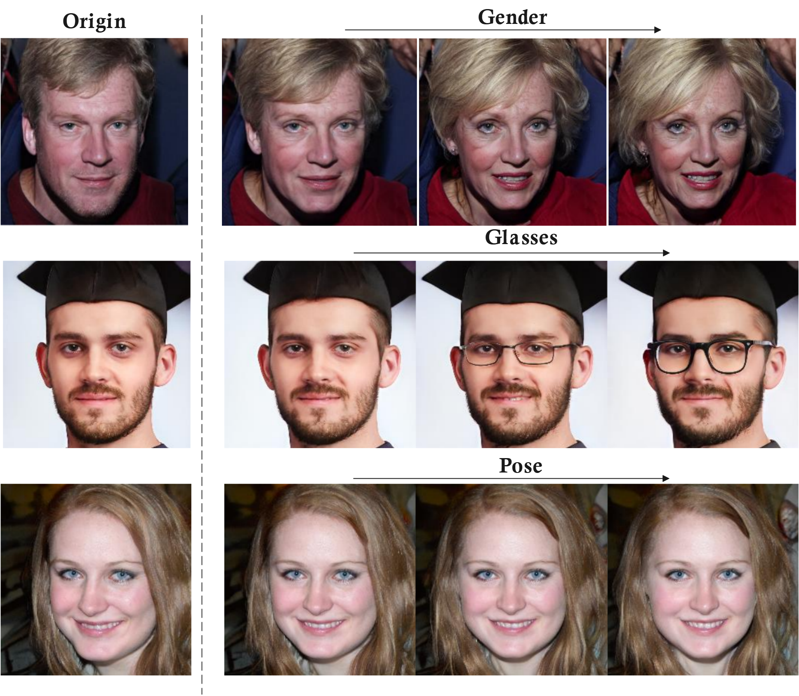

# NIMaGAN -  Non-linear Image Manipulation using iterative latent editing 


<p align="center">
  
</p>

**Figure:** *Iterative facial attribute editing using NimaGAN.*

This repo implements a method for using neural networks (NNs) to classify latent codes and then utilizes their gradients as directions for latent manipulation. Furthermore, the code employs an iterative editing process, allowing for automatic control of manipulation and instance-based boundary generation.

[[Paper (preprint)](https://papers.ssrn.com/sol3/papers.cfm?abstract_id=4768850)]


## Related Work

### Generative StyleGAN Models

This project builds upon the advancements in generative models, particularly the StyleGAN family. These models have demonstrated significant potential in producing high-quality images and enabling various types of latent space manipulations.

- **StyleGAN**: Introduced by NVIDIA, this model allows for highly realistic image synthesis. [Paper](https://arxiv.org/abs/1812.04948) | [Code](https://github.com/NVlabs/stylegan)
- **StyleGAN2**: An improved version with better image quality and control. [Paper](https://arxiv.org/abs/1912.04958) | [Code](https://github.com/NVlabs/stylegan2)

The generative models interface in this project is based on the models from the [InterfaceGAN paper](https://github.com/genforce/interfacegan), and the main structure of the code is inspired by their implementation.

## Tools
*generate_data.py*: Used for data preparation by generating a collection of images using a specified model. This script is particularly useful for building a dataset that maps input latent codes to corresponding attribute scores, which can then be used for further attribute prediction tasks.


```bash
python generate_data.py \
    -m model_name \
    -o output_directory \
    -i path/to/latent_codes.npy \
    -n 10 \
    -s z \
```

*edit.py*: Allows for editing latent codes using a pre-trained neural network classifier to manipulate image synthesis. The initial latent will be manipulated multiple steps toward the classifiers gradient.

```bash
python edit.py \
    -m stylegan2_ffhq \
    -o output_directory \
    -l path/to/latent_classifier.pkl \
    -i path/to/input_latent_codes.npy \
    -n 1 \
    -s z \
    --end_distance 3.0 \
    --steps 10

```

*train_classifier.py*:Designed to train a neural network classifier for latent codes. The trained neural network can then be used for latent manipulation, where the gradient of the network with respect to the input latent codes serves as the direction for editing the attributes of the generated images.

```bash
python train_classifier.py \
    -o output_directory \
    -c path/to/input_latent_codes.npy \
    -s path/to/input_attribute_scores.npy \
    -n 0.7 \
    -r 0.7 \
    -V None \
    -h 2 \
    -l 256

```

*frontalize_latent.py*: Designed to manipulate latent codes to produce frontalized faces. The neural network classifier is used to iteratively adjust the latent code so that the final generated face is frontalized. 

```bash
python frontalize_latent.py \
    -m model_name \
    -o output_directory \
    -l path/to/initial_latent_code.npy \
    -b path/to/saved_yaw_boundary.npy \
    -s z \
    -t 4.0 \
    -i 10 \
    -c path/to/pretrained_latent_classifier.pkl
```


## Citation

```
Kambarani, Nima and Ahmadi, Mohmmad Hossein and Mohammadi, Mohammad Reza, 
Nimagan: Non-Linear Image Manipulation Using Iterative Latent Editing.
Available at SSRN: https://ssrn.com/abstract=4768850 or http://dx.doi.org/10.2139/ssrn.4768850
```


